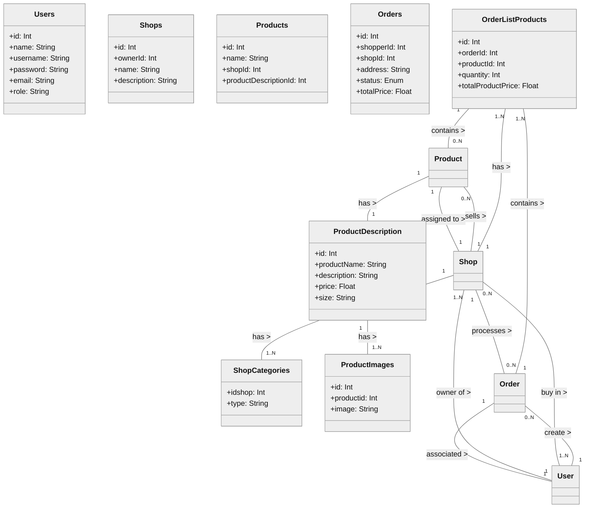

# 📜 Database design and UML

## 1️⃣ Introduction 
This document describes the system structure based on a **UML Class Diagram**, detailing the main entities, their attributes, and relationships. The **Virtual REC.0** project is a digital adaptation of the REC.0 of Igualada, an event focused on transforming old industrial areas into creative and commercial spaces. This virtual version aims to bring the unique shopping experience of REC.0 to an online platform (e-commerce), allowing users to explore shops, purchase products, and interact within a structured digital marketplace.

---

## 2️⃣ Justificación del UML  
The UML diagram represents the project requirements according to the statement, organizing the system into **users, shops, products, and orders**. Below is an explanation of each part of the design:

### **👤 User Model (`User`)**  
- **Reason:** Centralizes common information for different user types. 
- **Roles:**  
  - `Admin`: Manages the system, creates shops and salespeople.  
  - `Salesperson`: Manages their own shops and products.
  - `Shopper`: Buys products and places orders.  
- **Main methods:**  
  - `signIn()` and `signOut()` for authentication.  
  - `updateData()` in order to update the profile.  

---

### **🏪 Shop Model (`Shop`)**  
- **Motivo:** Represents the shop within the system. 
- **Main properties:**  
  - `name`, `description`, `categories` (shop classification).  
- **Relationships:**  
  - Each shop belongs to a `Salesperson`.  
  - It can contain multiple `Product` instances.  

---

### **📦 Product Model (`Product`)**  
- **Reason:** Allows salespeople to manage their products. 
- **Properties:**  
  - `name`, `description`, `price`, `size`, `images`.  
- **Relationships:**  
  - Belongs to a single `Shop`.  
  - Can receive multiple `Review` instances.  

---

### **📜 Order Model (`Order`)**  
- **Reason:** Represents an order placed by a `Shopper`.  
- **Properties:**  
  - `address`: Uses the `Address` class instead of just a string.  
  - `status`: Represents the order status.  
- **Methods:**  
  - `updateStatus()`: Changes the order status.
  - `cancelOrder()`: Allows order cancellation if not yet shipped. 
- **Relationships:**  
  - A `Shopper` can place multiple orders.  
  - Each `Order` can contain several `Product` instances.  
  - It is linked to a `Shop`, ensuring products come from the same store.  

---

### **📍 Address Model (`Address`)**  
- **Reason:** Allows shoppers to save multiple delivery addresses. 
- **Relationship:**  
  - A `Shopper` can have multiple `Address` instances.  

---

### **⭐ Review Model (`Review`)**  
- **Motivo:** Allows shoppers to rate products and shops. 
- **Properties:**  
  - `rating`: Score from 1 to 5.  
  - `comment`: User opinion.  
  - `date`: Date of the review.  
- **Relationships:**  
  - A `Shopper` can write multiple `Review` instances.  
  - A `Product` or `Shop` can have many reviews.  

---

## 3️⃣ 📌 UML Relationships
- `User <|-- Admin`, `User <|-- Salesperson`, `User <|-- Shopper`: Inheritance from the `User` class because all are types of User.  
- `Admin "1" -- "1..N" Salesperson`: An admin can create multiple salespeople. 
- `Salesperson "1" -- "1..N" Shop`: A salesperson manages one or more shops.
- `Shop "1" -- "0..N" Product`: A shop sells multiple products.
- `Shopper "1" -- "0..N" Order`: A shopper can place multiple orders.
- `Order "1" -- "1..N" Product`: An order can contain multiple products.
- `Shopper "1" -- "0..N" Address`: A shopper can register several addresses.
- `Shopper "1" -- "0..N" Review`: A shopper can write multiple reviews.

---

## 4️⃣ 🔹 UML Class Diagram
