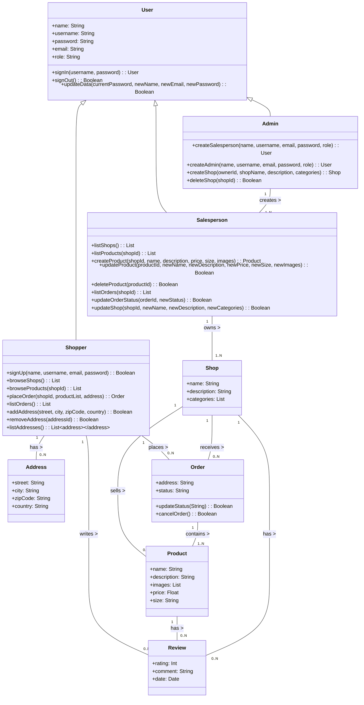

# 📜 Diseño de Base de Datos y UML

## 1️⃣ Introducción  
Este documento describe la estructura del sistema basada en un **Diagrama UML de Clases**, detallando las entidades principales, sus atributos y las relaciones entre ellas. Este diseño es crucial para garantizar un desarrollo sólido del backend del proyecto **Virtual REC Backend**, asegurando coherencia en la base de datos y la API REST.

---

## 2️⃣ Justificación del UML  
El diagrama UML refleja los requerimientos del proyecto según el enunciado, organizando el sistema en **usuarios, tiendas, productos y pedidos**. A continuación, se explica cada parte del diseño:

### **👤 Modelo de Usuario (`User`)**  
- **Motivo:** Centraliza la información común de los diferentes tipos de usuario.  
- **Roles:**  
  - `Admin`: Gestiona el sistema, crea tiendas y vendedores.  
  - `Salesperson`: Administra sus propias tiendas y productos.  
  - `Shopper`: Compra productos y realiza pedidos.  
- **Métodos principales:**  
  - `signIn()` y `signOut()` para autenticación.  
  - `updateData()` para actualizar perfil.  

---

### **🏪 Modelo de Tienda (`Shop`)**  
- **Motivo:** Representa una tienda dentro del sistema.  
- **Propiedades principales:**  
  - `name`, `description`, `categories` (clasificación de la tienda).  
- **Relaciones:**  
  - Cada tienda pertenece a un `Salesperson`.  
  - Puede contener múltiples `Product`.  

---

### **📦 Modelo de Producto (`Product`)**  
- **Motivo:** Permite a los vendedores gestionar sus productos.  
- **Propiedades:**  
  - `name`, `description`, `price`, `size`, `images`.  
- **Relaciones:**  
  - Pertenece a una única `Shop`.  
  - Puede recibir múltiples `Review`.  

---

### **📜 Modelo de Pedido (`Order`)**  
- **Motivo:** Representa un pedido hecho por un `Shopper`.  
- **Propiedades:**  
  - `address`: Ahora usa la clase `Address` en lugar de solo un string.  
  - `status`: Representa el estado del pedido.  
- **Métodos:**  
  - `updateStatus()`: Modifica el estado de la orden.  
  - `cancelOrder()`: Permite cancelar un pedido si aún no ha sido enviado.  
- **Relaciones:**  
  - Un `Shopper` puede realizar múltiples pedidos.  
  - Cada `Order` puede contener varios `Product`.  
  - Se asocia con una `Shop`, asegurando que los productos sean de la misma tienda.  

---

### **📍 Modelo de Dirección (`Address`)**  
- **Motivo:** Permite a los compradores guardar varias direcciones de entrega.  
- **Relación:**  
  - Un `Shopper` puede tener múltiples `Address`.  

---

### **⭐ Modelo de Reseñas (`Review`)**  
- **Motivo:** Permite que los compradores califiquen productos y tiendas.  
- **Propiedades:**  
  - `rating`: Puntuación del 1 al 5.  
  - `comment`: Opinión del usuario.  
  - `date`: Fecha de la reseña.  
- **Relaciones:**  
  - Un `Shopper` puede escribir múltiples `Review`.  
  - Un `Product` o `Shop` puede tener muchas reseñas.  

---

## 3️⃣ 📌 Relaciones en el UML  
- `User <|-- Admin`, `User <|-- Salesperson`, `User <|-- Shopper`: Herencia de la clase `User`.  
- `Admin "1" -- "1..N" Salesperson`: Un admin puede crear múltiples vendedores.  
- `Salesperson "1" -- "1..N" Shop`: Un vendedor gestiona una o más tiendas.  
- `Shop "1" -- "0..N" Product`: Una tienda vende múltiples productos.  
- `Shopper "1" -- "0..N" Order`: Un comprador puede hacer múltiples pedidos.  
- `Order "1" -- "1..N" Product`: Un pedido puede contener múltiples productos.  
- `Shopper "1" -- "0..N" Address`: Un comprador puede registrar varias direcciones.  
- `Shopper "1" -- "0..N" Review`: Un comprador puede escribir varias reseñas.  

---

## 4️⃣ 🔹 Conclusión  
Este diseño UML garantiza una estructura clara y modular, alineada con los requisitos del proyecto **Virtual REC Backend**. Las relaciones establecidas optimizan la funcionalidad de la base de datos y facilitan la implementación de la API REST.

(images/uml_part2.png)

