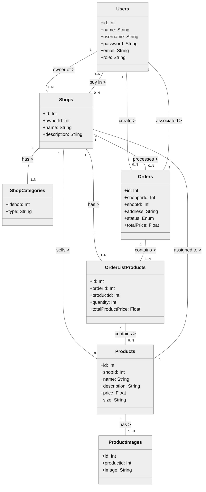

# 📜 Database design and UML

## 1️⃣ Justificació del UML  

A continuació es mostra en detall les decisions preses a nivell estructural en la creació de l'estrcutura del UML i en conseqüència de la base de dades.

En primer lloc es pot observar la presència de 7 entitats:

En aquest desenvolupament tenim 4 pilars fonamentals com son Users, Shops, Products i Orders. Aquestes han d'estar presents amb els seus atributs corrresponents tal i com es mostra en el UML.

D'altra banda hem fet ús de tres taules més auxiliars ja que així hem cregut convenient degut a les limitacions en les que ens trobem a nivell estrcutural en el projecte. L'ús d'una base de dades no relacional com és ara sqlite3 no ens permet tenir un vector dins d'una cel·la i en alguns casos, que a continuació específiquem ho necessitavem:

1. Una Shop pot tenir una o més categories associades per tant hem creat una taula auxiliar anomenada ShopCategories que ens permeti emmagetzemar aquesta informació.
2. Com en el cas anterior la taula Product també pot tenir més de una image i hem aplicat la mateixa lògica.
3. Aquest tercer cas ha estat més decisió personal de desenvolupament però també coincidionada en part pel que comentàvem anteriorment.
Una Order conté una llista de productes que només podem emmagetzemar amnb una taula auxiliar com orderListProducts.

## 2️⃣🔹 UML Class Diagram
